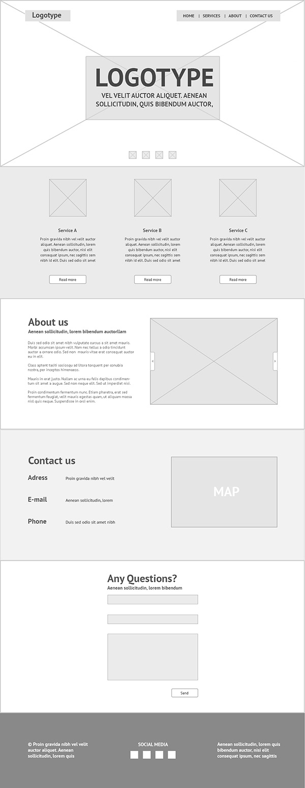
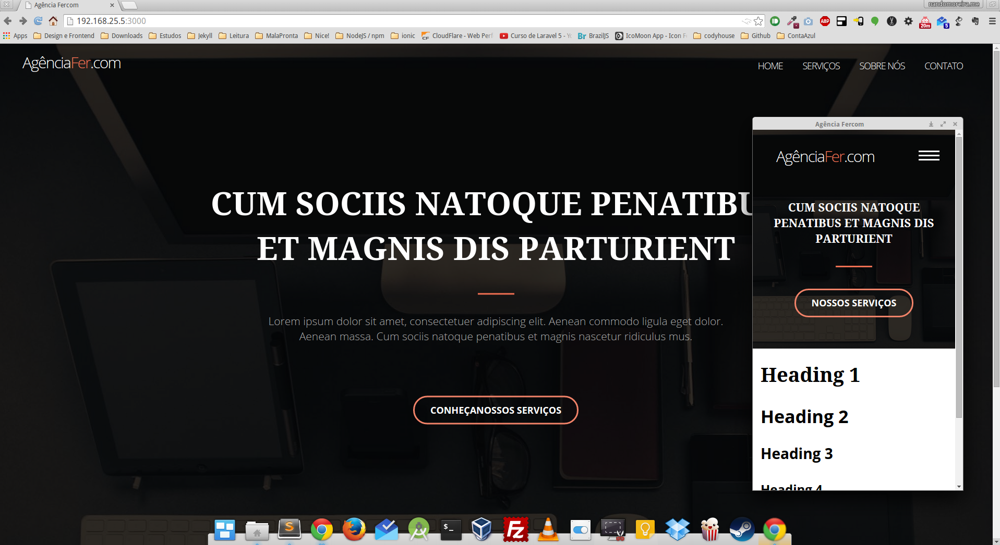

# Projeto Final da aula de Programação para Web

Desenvolver em HTML e CSS um site seguindo o wireframe em anexo. O tema é livre: pense que você está desenvolvendo um site de verdade. Porém utilize a mesma estrutura apresentada no wireframe (áreas, colunas, imagens, etc). Note que a área inicial é um slider de tela inteira.

É necessário utilizar Javascript, JQuery, Google Fonts, Google Maps, e outros que julgar necessário. Lembre que o site deve ser Responsivo. Para agilizar o processo, é permitido o uso de frameworks como Bootstrap.

Siga as normas e padrões W3C, com código limpo e indentado, seguindo orientações das aulas. Não serão aceitos temas prontos ou temas modificados. O aluno deve desenvolver um projeto completo.

Apresentação dia 28/09.

### Widreframe

### Versão inicial - Mobile first

